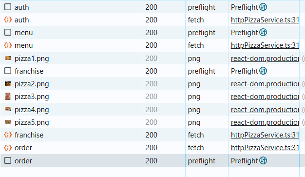
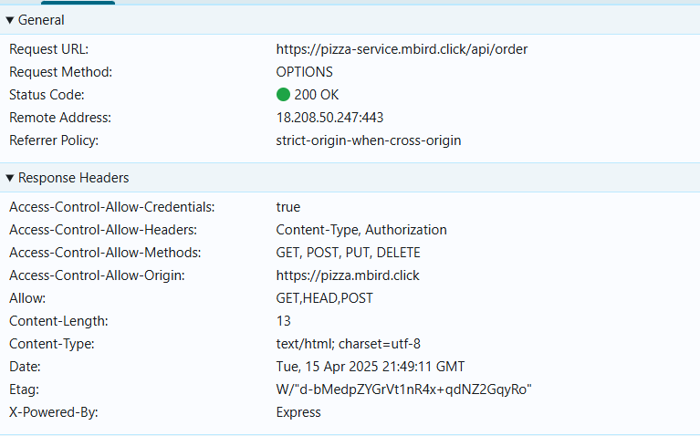

# Curiosity Report: CORS

CORS stands for **Cross-Origin Resource Sharing**. It is a **security feature** implemented by web browsers to control how web pages can request resources from a **different domain (origin)** than the one that served the original page.

In simpler terms, CORS determines whether a web page hosted on one domain can make requests to another domain.

CORS exists to protect users from websites trying to read data from other sites where the user is authenticated. Without CORS, a malicious site could send requests to other sites on behalf of the user and potentially access sensitive information.

## What does Cross-Origin mean?

Two URLs have different origins if they differ in:

- Protocol (http vs https)
- Domain (pizza.mbird.click vs pizza-service.mbird.click)
- Port (pizza.mbird.click:80 vs pizza.mbird.click:3000)

## How CORS Works

When a browser makes a cross-origin request, it automatically handles two types of CORS behavior:

### 1. Simple Requests

These are requests that:

- Use GET, POST, or HEAD methods
- Use only simple headers (Accept, Content-Type: application/x-www-form-urlencoded, etc.)

The browser **automatically includes an Origin header** and expects the server to respond with an Access-Control-Allow-Origin header.

Example:

Request:
Origin: https://pizza.mbird.click

Response:
Access-Control-Allow-Origin: https://pizza.mbird.click


If the response doesn’t include the expected CORS headers, the browser blocks the response.

### 2. Preflighted Requests

For more complex requests (PUT, DELETE, or custom headers), the browser sends a **preflight request** using the OPTIONS method to check if the real request is allowed.

In the process of logging in and buying a pizza from jwt pizza, the browser makes several preflight requests to the pizza service. 





Only if the preflight request is successful will the actual request be sent.

## Common CORS Response Headers

| Header                        | Description                                                    |
|------------------------------|----------------------------------------------------------------|
| Access-Control-Allow-Origin| Specifies which origin(s) can access the resource              |
| Access-Control-Allow-Methods| Lists the HTTP methods allowed            |
| Access-Control-Allow-Headers| Lists the headers that can be used in the request             |
| Access-Control-Allow-Credentials| Allows cookies and credentials if set to true         |
| Access-Control-Max-Age     | How long the results of a preflight request can be cached      |

## JWT Pizza's server side implementation

On the server side, you must configure CORS headers. In JWT Pizza service this is done with a middleware function which inserts the necessary headers on every response. 


```js
app.use((req, res, next) => {
  res.setHeader('Access-Control-Allow-Origin', req.headers.origin || '*');
  res.setHeader('Access-Control-Allow-Methods', 'GET, POST, PUT, DELETE');
  res.setHeader('Access-Control-Allow-Headers', 'Content-Type, Authorization');
  res.setHeader('Access-Control-Allow-Credentials', 'true');
  next();
});
```


