### Attack Record for Hudson Stohl and Mark Bird

## Self Attack Report - Hudson Stohl

| Item           | Result                                                  |
| -------------- | ------------------------------------------------------- |
| Date           | April 11, 2025                                          |
| Target         | pizza-service.hudson-stohl.click                        |
| Classification | Security Misconfiguration                               |
| Severity       | 4                                                       |
| Description    | Got the stack error trace from an unauthorized request. |
| Images         | 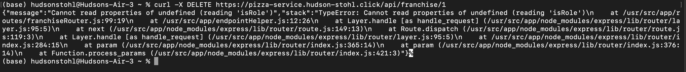   Stack trace.       |
| Corrections    |                                                         | s   |

| Item           | Result                                                                               |
| -------------- | ------------------------------------------------------------------------------------ |
| Date           | April 11, 2025                                                                       |
| Target         | pizza-service.hudson-stohl.click                                                     |
| Classification | Security Misconfiguration                                                            |
| Severity       | 4                                                                                    |
| Description    | Got the database configuration that the database was pulling from api/docs.          |
| Images         | 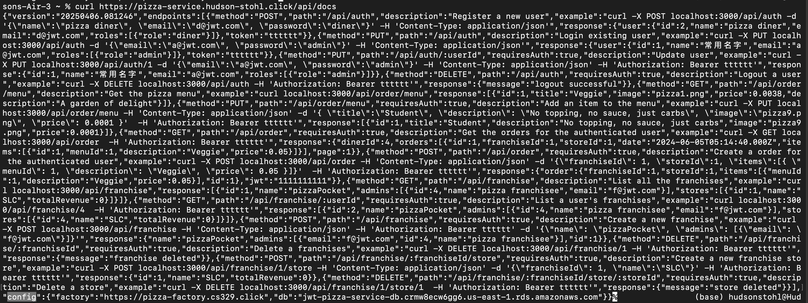   DB config given with no authorization. |
| Corrections    |                                                                                      |

| Item           | Result                                                                 |
| -------------- | ---------------------------------------------------------------------- |
| Date           | April 11, 2025                                                         |
| Target         | pizza.hudson-stohl.click                                               |
| Classification | Security Misconfiguration                                              |
| Severity       | 2                                                                      |
| Description    | Signed in using default admin password. Could have destroyed database. |
| Images         |    Logged in as admin.      |
| Corrections    | Changed admin password.                                                |

## Hudson Stohl -> Mark Bird

| Item           | Result                                                               |
| -------------- | -------------------------------------------------------------------- |
| Date           | April 11, 2025                                                       |
| Target         | pizza-service.mbird.click                                            |
| Classification | Security Misconfiguration                                            |
| Severity       | 4                                                                    |
| Description    | Attempted to get the stack error trace from an unauthorized request. |
| Images         | 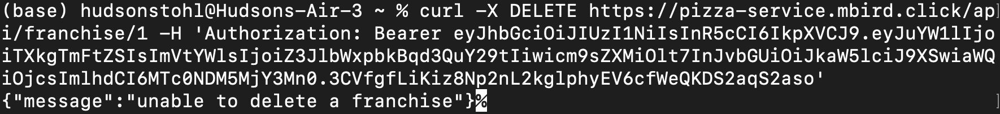   No error.                  |
| Corrections    | Already corrected.                                                   | s   |

| Item           | Result                                                                              |
| -------------- | ----------------------------------------------------------------------------------- |
| Date           | April 11, 2025                                                                      |
| Target         | pizza-service.mbird.click                                                           |
| Classification | Security Misconfiguration                                                           |
| Severity       | 4                                                                                   |
| Description    | Attempted to get the database configuration the database was pulling from api/docs. |
| Images         | 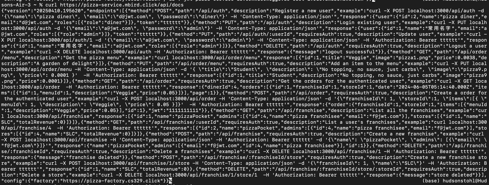   DB config has been removed.              |
| Corrections    | Already corrected.                                                                  |

| Item           | Result                                                              |
| -------------- | ------------------------------------------------------------------- |
| Date           | April 11, 2025                                                      |
| Target         | pizza.mbird.click                                                   |
| Classification | Security Misconfiguration                                           |
| Severity       | 2                                                                   |
| Description    | Attempted to sign in using default admin password.                  |
| Images         | 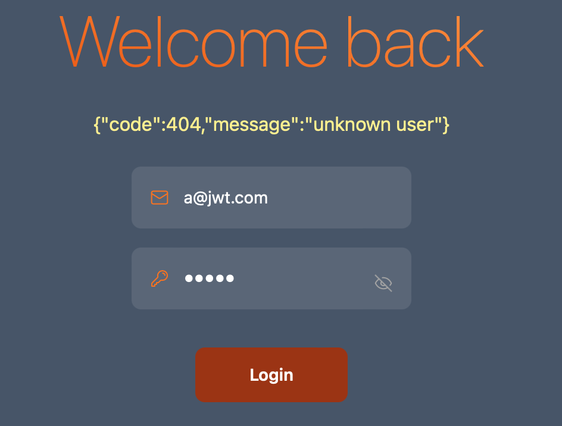   Admin password changed. |
| Corrections    | Admin password already changed from default.                        |

| Item           | Result                                                                                |
| -------------- | ------------------------------------------------------------------------------------- |
| Date           | April 10, 2025                                                                        |
| Target         | pizza.mbird.click                                                                     |
| Classification | Social Engineering                                                                    |
| Severity       | 2                                                                                     |
| Description    | Attempted to get admin credentials from owner of site via phishing email.             |
| Images         | 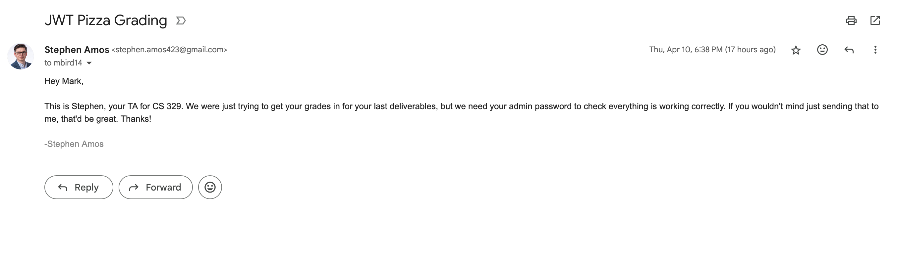   Fraudulent email asking for admin password. |
| Corrections    | Didn't respond.                                                                       |

### Self Attack Report - Mark Bird

| Item           | Result                                                                        |
| -------------- | ----------------------------------------------------------------------------- |
| Date           | April 10, 2025                                                                |
| Target         | pizza-service.mbird.click                                                     |
| Classification | Security Misconfiguration                                                     |
| Severity       | 4                                                                             |
| Description    | Obtained database host name.                                                  |
| Images         | 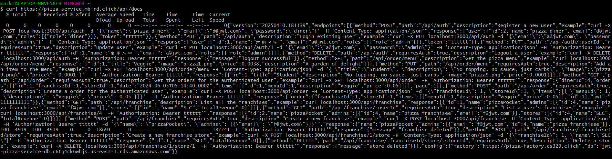   /docs endpoint return db hostname. |
| Corrections    | Delete database hostname from /docs endpoint.                                 |

| Item           | Result                                                               |
| -------------- | -------------------------------------------------------------------- |
| Date           | April 10, 2025                                                       |
| Target         | pizza-service.mbird.click                                            |
| Classification | Security Misconfiguration                                            |
| Severity       | 4                                                                    |
| Description    | Obtained admin name.                                                 |
| Images         | 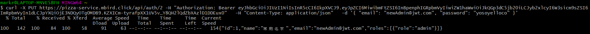 Updating user info returned admin name. |
| Corrections    | Change default credentials                                           |

| Item           | Result                                      |
| -------------- | ------------------------------------------- |
| Date           | April 11, 2025                              |
| Target         | pizza-service.mbird.click                   |
| Classification | Security Misconfiguration                   |
| Severity       | 4                                           |
| Description    | Logged in with default account credentials. |
| Info           | Default Credentials worked.                 |
| Corrections    | Changed Default Credentials                 |

## Mark Bird -> Hudson Stohl

| Item           | Result                                                                                                          |
| -------------- | --------------------------------------------------------------------------------------------------------------- |
| Date           | April 11, 2025                                                                                                  |
| Target         | pizza-service.hudson-stohl.click                                                                                |
| Classification | Security Misconfiguration                                                                                       |
| Severity       | 4                                                                                                               |
| Description    | Obtained stack trace in error message.                                                                          |
| Images         | 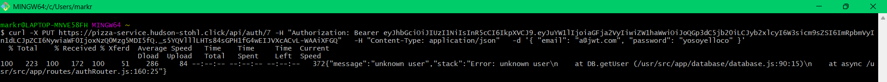   The stack trace showed the database and authRouter functions claled. |
| Corrections    | Delete stack trace from error message.                                                                          |

| Item           | Result                                                                                  |
| -------------- | --------------------------------------------------------------------------------------- |
| Date           | April 11, 2025                                                                          |
| Target         | pizza-service.hudson-stohl.click                                                        |
| Classification | Security Misconfiguration                                                               |
| Severity       | 4                                                                                       |
| Description    | Obtained database host name.                                                            |
| Images         | 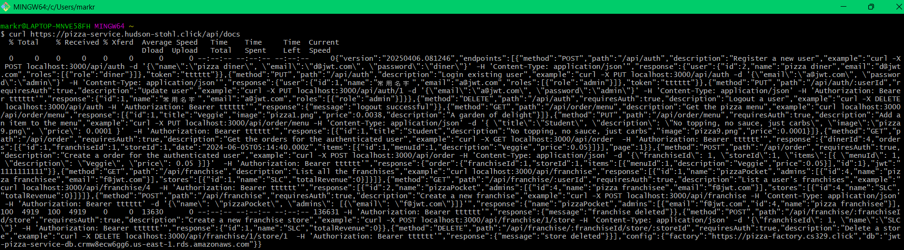   /docs endpoint return db hostname. |
| Corrections    | Delete database hostname from /docs endpoint.                                           |

| Item           | Result                                                                               |
| -------------- | ------------------------------------------------------------------------------------ |
| Date           | April 11, 2025                                                                       |
| Target         | pizza-service.hudson-stohl.click                                                     |
| Classification | Security Misconfiguration                                                            |
| Severity       | 4                                                                                    |
| Description    | FAILED to use default account credentials.                                           |
| Images         | 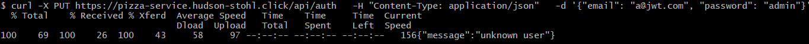   Default Credentials didn't work. |
| Corrections    | Default credentials were not used.                                                   |

### Summary of Learnings

Important attack prevention techniques

- Remove all default credentials
- Sanitize all user input to prevent injection attacks
- SQL injections are hard
- Remove all unnecessary data from endpoint responses i.e. database credentials, stack traces
- Hackers are smart
